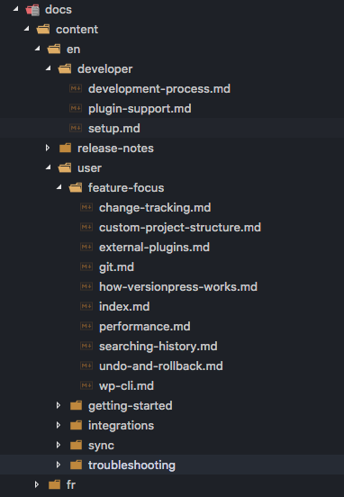

# VersionPress docs

## Developer documentation

- [Plugin Support](/en/developer/plugin-support.md)
- [Developer Setup](/en/developer/setup.md)
- [Development Process](/en/developer/development-process.md)

## User documentation

User documentation is authored in the `content` folder and published to [docs.versionpress.net](http://docs.versionpress.net/en), a site powered by [`versionpress/docs-site`](https://github.com/versionpress/docs-site).

### Overview

VersionPress uses a Python based docs system called [MkDocs](https://www.mkdocs.org/). The content is authored as a set of Markdown files in this repo, built through `mkdocs build` and eventually published at [docs.versionpress.net](http://docs.versionpress.net/en).

Documentation is authored in **Markdown**. See [authoring tips below](#authoring-documentation).

Content is organized in **the `content` directory**:



**URLs** map to this structure pretty closely. `index.md` are special files representing section homepages. Some examples:

| File on disk                       | URL                |
| ---------------------------------- | ------------------ |
| `content/en/sync/cloning.md`       | `/en/sync/cloning` |
| `content/en/sync/index.md`         | `/en/sync`         |
| `content/en/index.md`              | `/en`              |

**Site navigation** is defined in the `mkdocs.yml` file in the root directory. This file must be manually updated whenever a new file is added or an existing file is moved. This structure will automatically generate the navigation on the site in both the sidebar and in the "next"/"previous" links in the footer.

We **don't really use docs versioning** via URL like "/latest" or "/v2", the state of the documentation in `master` should reflect all versions. If something has been deprecated or is new, just indicate it in the text.

### Authoring documentation

 - **Start each file with an H1 header** (`# Some Title`). This MUST be the first non-front-matter line of the document; the navigation system depends on it.
 - Use **'Title Case' for H1** headers, **'Sentence case' for H2** and below.
 - **Images**: max 700px wide, optimize them, paste to GitHub and copy the URL. Include them into Markdown like this:
    ```
    <figure style="width: 80%;">
      
      <figcaption>Image caption</figcaption>
    </figure>
    ```
 - **Notes / warnings / tips** and other kinds of notes can be written in special boxes.
 Admonition is an extension included in the standard Markdown library that makes it possible to add block-styled side content to your documentation, for example summaries, notes, hints or warnings. Supported types are listed at [the Admonition documentation](https://squidfunk.github.io/mkdocs-material/extensions/admonition/). The syntax is:
    ```
    !!! Note "Note Title"
        This will be rendered in a highlighted box. Pay attention to the spaces below the !!!
    ```

    !!! Note "Note Title"
        This will be rendered in a highlighted box. Pay attention to the spaces below the !!!

    ```
    !!! Warning "Warning Title"
        This will be rendered in a highlighted box. Pay attention to the spaces below the !!!
    ```

    !!! Warning "Warning Title"
        This will be rendered in a highlighted box. Pay attention to the spaces below the !!!

    ```
    !!! Danger ""
        This will be rendered in a highlighted box with **NO TITLE**.
    ```

    !!! Danger ""
        This will be rendered in a highlighted box with **NO TITLE**.

 - **TODO markers** can be written as `[TODO]` or `[TODO some arbitrary text]`. They will be highlighted in yellow and should be used rarely, possibly in alpha / beta versions of the doc topic.
 - **Emojis** You can use [emoji shortcodes](https://www.webpagefx.com/tools/emoji-cheat-sheet/) to display on your pages. :metal: :raised_hands: :sparkles: :boom: :clap: :tada:
 - **Magic Links** You can use link shorthand and mentions using the [MagicLink](https://facelessuser.github.io/pymdown-extensions/extensions/magiclink/) markdown plugin. Just paste links directly in the document like this: https://google.com. Or even an email address: fake.email@email.com. Check out [the docs](https://facelessuser.github.io/pymdown-extensions/extensions/magiclink/) for other tricks using github pull requests etc.

### Deploying docs

When a PR is merged into `master`, it is automatically deployed to [docs.versionpress.net](http://docs.versionpress.net/en).


### Redirects

- [ ] TODO: how to make redirects work in mkdocs
  * one way is to leave old file but add `<meta http-equiv="refresh" content="0; url=new" />` to redirect it
  * discussions on board about plugins (if someone could port https://github.com/jekyll/jekyll-redirect-from that would be awesome)

### Theme Info

The theme is modded from the 3rd party theme [Material](https://squidfunk.github.io/mkdocs-material/), used more for it's function than it's look.

Some of this functionality includes:

* better mobile support
* embedded search
* configuration within mkdocs.yml
  * easy color customization / syntax highlighting
  * easy font changes
  * branding options
  * localization - in the event that we branch documentation beyond english in future
  * fast search using [lunr.js](https://lunrjs.com/) and tokenizer settings (index words separated by - or .)
  * markdown extensions
    * see mkdocs.yml file for list of enabled extensions

You can customize the theme by updating the following files:

  * /stylesheets/extra.css (slight modifications have been made there to make current site look like last version)
  * /javascript/extra.js

  OR

You can override Material and create a ['child theme'](https://www.mkdocs.org/user-guide/styling-your-docs/#using-the-theme-custom_dir) in the vp_theme directory. Any file in the Material theme can be overridden by adding a modified version of that file in the same structure. Support for this already exists in the configuration.
